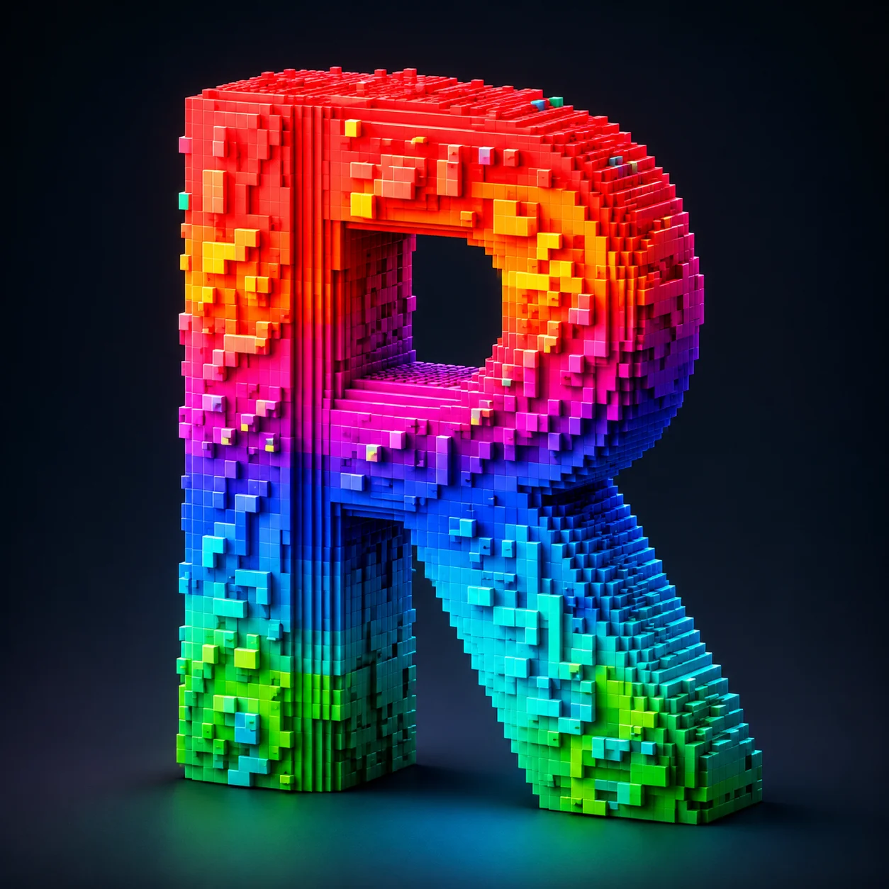

# AtomRGB 0.1

<p align="center">
  
</p>

macOS RGB controller for the Fantech ATOM PRO63 MK912.

Version 0.1 is the first usable global-RGB release: it reads and writes the
keyboard's lighting state through the confirmed wired USB protocol and includes
a native SwiftUI controller app.

## Hardware identity

- Product: `Fantech Atom Pro Keyboard`
- Manufacturer: `ZXWMicroChip`
- VID: `0x5566`
- PID: `0x0008`
- Initial scope: wired USB mode
- RGB interface: USB Interface 2 / `ZXWCustom`
- RGB reports: 64-byte input/output, no HID Report ID

The global RGB protocol is now documented from the Windows Fantech utility capture analysis. The repository currently contains the supplied protocol report and packet fixtures, but not the original `.pcapng` files. Hardware writes remain explicitly gated behind `atomctl --write`.

The RGB MVP uses only Interface 2. The earlier logical `0xFF00` privilege result is documented as an upstream HIDAPI/macOS access issue and is not required. Per-key RGB, key remapping, macros, firmware updates, profiles, and wireless mode remain out of scope.

See [IMPLEMENTATION_PLAN.md](IMPLEMENTATION_PLAN.md) for the execution plan and [Fantech_MK912_macOS_RGB_Reverse_Engineering_Plan.md](Fantech_MK912_macOS_RGB_Reverse_Engineering_Plan.md) for the original research.

## Try it

Read the current device state:

```bash
swift run atomctl state
swift run atomctl state --json
```

Mutating CLI commands are dry-run by default. Use `--write` only when you intend to change the keyboard:

```bash
swift run atomctl --dry-run static FF0000
swift run atomctl --write static FF0000
swift run atomctl --write brightness 50
swift run atomctl --write effect wave
swift run atomctl --write speed slow
swift run atomctl --write direction reverse
swift run atomctl --write colorful on
```

The experimental SwiftUI app can be launched with:

```bash
swift run AtomRGBApp
```

When launched this way, the app explicitly uses the regular macOS activation
policy, so it appears in the Dock and can be brought back to the front by
clicking its Dock item.

## Release build

Build the versioned macOS app bundle and DMG:

```bash
./tools/build_dmg.sh
open dist/AtomRGB-0.1.dmg
```

The DMG is an unsigned development build. The generated `dist/AtomRGB-0.1.dmg`
and checksum can be attached to a GitHub release.

The repository keeps `AtomRGB.png` as the source artwork for the macOS icon.
The README uses the smaller `AtomRGB.webp` copy, while the packaging script
generates the required `.icns` app icon from the PNG.

## Roadmap

### 0.1 — shipped

- Windows protocol discovery completed for global RGB control.
- Safe Interface-2 HID transport with GET-before-SET read-modify-write.
- Dry-run-first `atomctl` CLI with JSON state output.
- Hardware-proven static-red replay and state restoration path.
- SwiftUI controls for effects, brightness, speed, direction, Colorful, and RGB color.
- Dock-visible app behavior, reconnect polling, app bundle, and DMG packaging.

### Next

- Complete the hardware matrix for all 22 effects and remaining speed/direction combinations.
- Validate unplug/reconnect behavior and normal typing during every lighting update.
- Run the XCTest suite under full Xcode and add continuous integration.
- Sign and notarize a public macOS release when distribution credentials are available.
- Archive any original Windows `.pcapng` captures when they become available.

### Later / out of scope for 0.1

- Per-key RGB and key-index editing.
- Key remapping, macros, profiles, and firmware updates.
- Wireless-mode support.
- The separate `0xFF00` HID collection.
